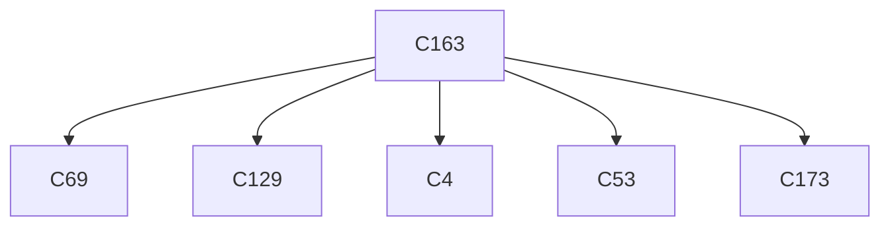
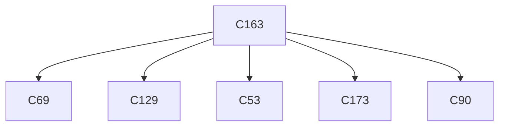

# Semantic RCA Report

---
# Incident I1

## Incident Window
2023-01-27T18:28:08.127428+00:00 → 2023-01-27T18:29:58.127428+00:00

## Root Cause

Cluster: `C163`
Score: 93.87

### Explanation
system:serviceaccount:gatekeeper-system:gatekeeper-admin attempted to list assignmetadata via  resulting in HTTP 404

### Key Signals
- trigger_score: 2.912427
- error_count: 108
- graph_out_weight: 10.95
- graph_in_weight: 5.0

### Causal Propagation


### Primary Evidence Event
```
"{""name"":""k8s-master-perfspec""}",2023-01-27T18:28:22.470778Z,system:serviceaccount:gatekeeper-system:gatekeeper-admin,list,assignmetadata,,,,/apis/mutations.gatekeeper.sh/v1/assignmetadata?resourceVersion=6135961,2c893351-f825-40f8-9bf7-19ff1de0fb4f,ResponseComplete,404,,,
```

## Other Possible Contributors

| Rank | Cluster | Score | Errors |
|------|--------|------|------|
| 2 | C106 | 41.56 | 24 |
| 3 | C165 | 33.87 | 28 |
| 4 | C77 | 29.96 | 36 |
| 5 | C131 | 25.76 | 16 |

---
# Incident I2

## Incident Window
2023-01-27T18:30:58.127428+00:00 → 2023-01-27T18:31:48.127428+00:00

## Root Cause

Cluster: `C163`
Score: 87.76

### Explanation
system:serviceaccount:gatekeeper-system:gatekeeper-admin attempted to list assignmetadata via  resulting in HTTP 404

### Key Signals
- trigger_score: 2.912427
- error_count: 108
- graph_out_weight: 8.06
- graph_in_weight: 0.0

### Causal Propagation


### Primary Evidence Event
```
"{""name"":""k8s-master-perfspec""}",2023-01-27T18:28:22.470778Z,system:serviceaccount:gatekeeper-system:gatekeeper-admin,list,assignmetadata,,,,/apis/mutations.gatekeeper.sh/v1/assignmetadata?resourceVersion=6135961,2c893351-f825-40f8-9bf7-19ff1de0fb4f,ResponseComplete,404,,,
```

## Other Possible Contributors

| Rank | Cluster | Score | Errors |
|------|--------|------|------|
| 2 | C15 | 83.37 | 23 |
| 3 | C117 | 54.84 | 4 |
| 4 | C0 | 47.13 | 90 |
| 5 | C77 | 45.38 | 36 |
