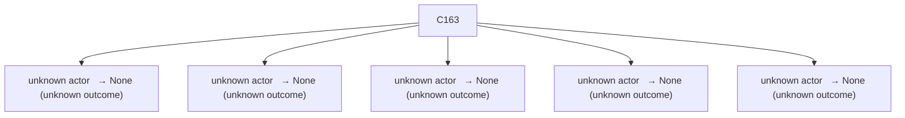

# Semantic RCA Report

---
# Incident I1

## Incident Window
2023-01-27T18:28:08.127428+00:00 → 2023-01-27T18:29:58.127428+00:00

## Root Cause

Cluster: `C163`
Score: 297.35

### Cluster Behavior
unknown actor   → None (unknown outcome)

### Trigger Explanation
system:serviceaccount:gatekeeper-system:gatekeeper-admin attempted to list assignmetadata via  resulting in HTTP 404

### Key Signals
- trigger_score: 2.912427
- error_count: 108
- graph_out_weight: 102.11999999999996
- graph_in_weight: 98.92999999999998

### Blast Radius
Affected downstream clusters: **5**

### Causal Propagation


### Primary Evidence Event
```
"{""name"":""k8s-master-perfspec""}",2023-01-27T18:28:22.470778Z,system:serviceaccount:gatekeeper-system:gatekeeper-admin,list,assignmetadata,,,,/apis/mutations.gatekeeper.sh/v1/assignmetadata?resourceVersion=6135961,2c893351-f825-40f8-9bf7-19ff1de0fb4f,ResponseComplete,404,,,
```

## Other Possible Contributors

| Rank | Cluster | Behavior | Score | Errors |
|------|--------|----------|------|------|
| 2 | C165 | unknown actor   → None (unknown outcome) | 33.87 | 28 |
| 3 | C105 | unknown actor   → None (unknown outcome) | 27.28 | 8 |
| 4 | C131 | unknown actor   → None (unknown outcome) | 25.76 | 16 |
| 5 | C19 | unknown actor   → None (unknown outcome) | 25.01 | 114 |

---
# Incident I2

## Incident Window
2023-01-27T18:30:58.127428+00:00 → 2023-01-27T18:31:48.127428+00:00

## Root Cause

Cluster: `C163`
Score: 224.14

### Cluster Behavior
unknown actor   → None (unknown outcome)

### Trigger Explanation
system:serviceaccount:gatekeeper-system:gatekeeper-admin attempted to list assignmetadata via  resulting in HTTP 404

### Key Signals
- trigger_score: 2.912427
- error_count: 108
- graph_out_weight: 79.03
- graph_in_weight: 78.02999999999999

### Blast Radius
Affected downstream clusters: **5**

### Causal Propagation


### Primary Evidence Event
```
"{""name"":""k8s-master-perfspec""}",2023-01-27T18:28:22.470778Z,system:serviceaccount:gatekeeper-system:gatekeeper-admin,list,assignmetadata,,,,/apis/mutations.gatekeeper.sh/v1/assignmetadata?resourceVersion=6135961,2c893351-f825-40f8-9bf7-19ff1de0fb4f,ResponseComplete,404,,,
```

## Other Possible Contributors

| Rank | Cluster | Behavior | Score | Errors |
|------|--------|----------|------|------|
| 2 | C27 | unknown actor   → None (unknown outcome) | 65.20 | 11 |
| 3 | C117 | unknown actor   → None (unknown outcome) | 53.24 | 4 |
| 4 | C0 | unknown actor   → None (unknown outcome) | 47.13 | 90 |
| 5 | C188 | unknown actor   → None (unknown outcome) | 29.48 | 4 |
