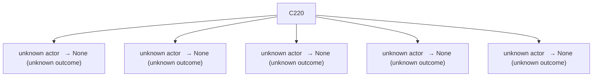

# Semantic RCA Report

---
# Incident I1

## Incident Window
2023-01-27T18:28:08.127428+00:00 → 2023-01-27T18:29:58.127428+00:00

## Root Cause

Cluster: `C220`
Score: 52.90

### Cluster Behavior
unknown actor   → None (unknown outcome)

### Trigger Explanation
system:serviceaccount:kube-system:replicaset-controller attempted to create pods via  resulting in HTTP 403

### Key Signals
- trigger_score: 1.526411
- error_count: 16
- graph_out_weight: 29.909999999999993
- graph_in_weight: 29.209999999999997

### Blast Radius
Affected downstream clusters: **5**

### Causal Propagation


### Primary Evidence Event
```
"{""name"":""k8s-master-perfspec""}",2023-01-27T18:28:42.240231Z,system:serviceaccount:kube-system:replicaset-controller,create,pods,,,,/api/v1/namespaces/kube-system/pods,946864b4-1ff2-4d8c-887c-ad9982bad0d7,ResponseComplete,403,,,
```

## Other Possible Contributors

| Rank | Cluster | Behavior | Score | Errors |
|------|--------|----------|------|------|
| 2 | C163 | unknown actor   → None (unknown outcome) | 51.55 | 108 |
| 3 | C131 | unknown actor   → None (unknown outcome) | 25.76 | 16 |
| 4 | C19 | unknown actor   → None (unknown outcome) | 25.01 | 114 |
| 5 | C18 | unknown actor   → None (unknown outcome) | 24.62 | 17 |

---
# Incident I2

## Incident Window
2023-01-27T18:30:58.127428+00:00 → 2023-01-27T18:31:48.127428+00:00

## Root Cause

Cluster: `C163`
Score: 50.38

### Cluster Behavior
unknown actor   → None (unknown outcome)

### Trigger Explanation
system:serviceaccount:gatekeeper-system:gatekeeper-admin attempted to list assignmetadata via  resulting in HTTP 404

### Key Signals
- trigger_score: 2.912427
- error_count: 108
- graph_out_weight: 0.0
- graph_in_weight: 0.0

### Blast Radius
Affected downstream clusters: **0**

### Causal Propagation
No downstream propagation detected.

### Primary Evidence Event
```
"{""name"":""k8s-master-perfspec""}",2023-01-27T18:28:22.470778Z,system:serviceaccount:gatekeeper-system:gatekeeper-admin,list,assignmetadata,,,,/apis/mutations.gatekeeper.sh/v1/assignmetadata?resourceVersion=6135961,2c893351-f825-40f8-9bf7-19ff1de0fb4f,ResponseComplete,404,,,
```

## Other Possible Contributors

| Rank | Cluster | Behavior | Score | Errors |
|------|--------|----------|------|------|
| 2 | C0 | unknown actor   → None (unknown outcome) | 47.13 | 90 |
| 3 | C220 | unknown actor   → None (unknown outcome) | 40.18 | 16 |
| 4 | C117 | unknown actor   → None (unknown outcome) | 31.19 | 4 |
| 5 | C188 | unknown actor   → None (unknown outcome) | 29.48 | 4 |
