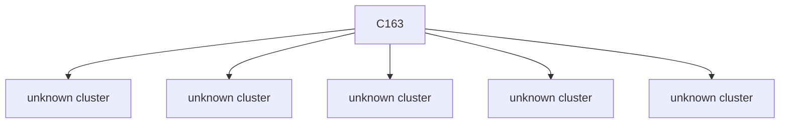

# Semantic RCA Report

---
# Incident I1

## Incident Window
2023-01-27T18:28:08.127428+00:00 → 2023-01-27T18:29:58.127428+00:00

## Root Cause

Cluster: `C163`
Score: 95.07

### Cluster Behavior
system:serviceaccount:gatekeeper-system:gatekeeper-admin list assignmetadata → HTTP 404 (authorization/client errors)

### Trigger Explanation
system:serviceaccount:gatekeeper-system:gatekeeper-admin attempted to list assignmetadata via  resulting in HTTP 404

### Key Signals
- trigger_score: 2.912427
- error_count: 108
- graph_out_weight: 10.949999999999998
- graph_in_weight: 5.0

### Blast Radius
Affected downstream clusters: **5**

### Trigger / Lag / Lead

- Trigger: system:serviceaccount:gatekeeper-system:gatekeeper-admin list assignmetadata → HTTP 404 (authorization/client errors)
- Lag: unknown cluster ; unknown cluster ; unknown cluster ; unknown cluster ; unknown cluster
- Lead: unknown cluster ; unknown cluster ; unknown cluster ; unknown cluster ; unknown cluster

### Causal Propagation


### Primary Evidence Event
```
"{""name"":""k8s-master-perfspec""}",2023-01-27T18:28:22.470778Z,system:serviceaccount:gatekeeper-system:gatekeeper-admin,list,assignmetadata,,,,/apis/mutations.gatekeeper.sh/v1/assignmetadata?resourceVersion=6135961,2c893351-f825-40f8-9bf7-19ff1de0fb4f,ResponseComplete,404,,,
```

## Other Possible Contributors

| Rank | Cluster | Behavior | Score | Errors |
|------|--------|----------|------|------|
| 2 | C81 | system:serviceaccount:kube-system:endpointslice-controller update resource → HTTP 200 (successful operations) | 38.01 | 10 |
| 3 | C67 | unknown actor create resource → HTTP 201 (successful operations) | 35.89 | 9 |
| 4 | C165 | unknown actor delete resource → HTTP 200 (successful operations) | 33.87 | 28 |
| 5 | C131 | system:apiserver get resource → HTTP 404 (authorization/client errors) | 25.76 | 16 |

---
# Incident I2

## Incident Window
2023-01-27T18:30:58.127428+00:00 → 2023-01-27T18:31:48.127428+00:00

## Root Cause

Cluster: `C163`
Score: 80.11

### Cluster Behavior
system:serviceaccount:gatekeeper-system:gatekeeper-admin list assignmetadata → HTTP 404 (authorization/client errors)

### Trigger Explanation
system:serviceaccount:gatekeeper-system:gatekeeper-admin attempted to list assignmetadata via  resulting in HTTP 404

### Key Signals
- trigger_score: 2.912427
- error_count: 108
- graph_out_weight: 6.87
- graph_in_weight: 2.0

### Blast Radius
Affected downstream clusters: **5**

### Trigger / Lag / Lead

- Trigger: system:serviceaccount:gatekeeper-system:gatekeeper-admin list assignmetadata → HTTP 404 (authorization/client errors)
- Lag: unknown cluster ; unknown cluster ; unknown cluster ; unknown cluster ; unknown cluster
- Lead: unknown cluster ; unknown cluster ; unknown cluster ; unknown cluster ; unknown cluster

### Causal Propagation


### Primary Evidence Event
```
"{""name"":""k8s-master-perfspec""}",2023-01-27T18:28:22.470778Z,system:serviceaccount:gatekeeper-system:gatekeeper-admin,list,assignmetadata,,,,/apis/mutations.gatekeeper.sh/v1/assignmetadata?resourceVersion=6135961,2c893351-f825-40f8-9bf7-19ff1de0fb4f,ResponseComplete,404,,,
```

## Other Possible Contributors

| Rank | Cluster | Behavior | Score | Errors |
|------|--------|----------|------|------|
| 2 | C27 | system:serviceaccount:kube-system:deployment-controller update resource → HTTP 200 (successful operations) | 57.34 | 11 |
| 3 | C0 | unknown actor get resource → HTTP 404 (authorization/client errors) | 47.13 | 90 |
| 4 | C81 | system:serviceaccount:kube-system:endpointslice-controller update resource → HTTP 200 (successful operations) | 43.56 | 10 |
| 5 | C67 | unknown actor create resource → HTTP 201 (successful operations) | 42.54 | 9 |
