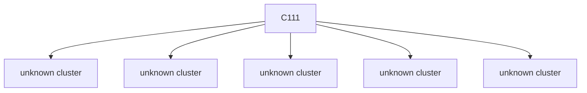

# Semantic RCA Report

---
# Incident I1

## Incident Window
2023-01-27T18:28:08.127428+00:00 → 2023-01-27T18:29:58.127428+00:00

## Root Cause

Cluster: `C111`
Score: 55.37

### Cluster Behavior
system:node:k8s-node-1-perfspec list resource → HTTP 403 (authorization/client errors)

### Trigger Explanation
system:node:k8s-node-1-perfspec attempted to list configmaps via  resulting in HTTP 403

### Key Signals
- trigger_score: 2.501197
- error_count: 5
- graph_out_weight: 21.40999999999999
- graph_in_weight: 21.409999999999997

### Blast Radius
Affected downstream clusters: **5**

### Trigger / Lag / Lead

- Trigger: system:node:k8s-node-1-perfspec list resource → HTTP 403 (authorization/client errors)
- Lag: unknown cluster ; unknown cluster ; unknown cluster ; unknown cluster ; unknown cluster
- Lead: unknown cluster ; unknown cluster ; unknown cluster ; unknown cluster ; unknown cluster

### Causal Propagation


### Primary Evidence Event
```
"{""name"":""k8s-master-perfspec""}",2023-01-27T18:28:43.254658Z,system:node:k8s-node-1-perfspec,list,configmaps,,my-airflow-airflow-config,,/api/v1/namespaces/default/configmaps?fieldSelector=metadata.name%3Dmy-airflow-airflow-config&resourceVersion=6135895,0a48a281-dd2c-4f7b-b35f-19b8adf82ab3,ResponseComplete,403,,,
```

## Other Possible Contributors

| Rank | Cluster | Behavior | Score | Errors |
|------|--------|----------|------|------|
| 2 | C163 | system:serviceaccount:gatekeeper-system:gatekeeper-admin list assignmetadata → HTTP 404 (authorization/client errors) | 51.55 | 108 |
| 3 | C131 | system:apiserver get resource → HTTP 404 (authorization/client errors) | 25.76 | 16 |
| 4 | C19 | unknown actor get resource → HTTP 404 (authorization/client errors) | 25.01 | 114 |
| 5 | C18 | unknown actor create resource → HTTP 409 (authorization/client errors) | 24.62 | 17 |

---
# Incident I2

## Incident Window
2023-01-27T18:30:58.127428+00:00 → 2023-01-27T18:31:48.127428+00:00

## Root Cause

Cluster: `C163`
Score: 50.38

### Cluster Behavior
system:serviceaccount:gatekeeper-system:gatekeeper-admin list assignmetadata → HTTP 404 (authorization/client errors)

### Trigger Explanation
system:serviceaccount:gatekeeper-system:gatekeeper-admin attempted to list assignmetadata via  resulting in HTTP 404

### Key Signals
- trigger_score: 2.912427
- error_count: 108
- graph_out_weight: 0.0
- graph_in_weight: 0.0

### Blast Radius
Affected downstream clusters: **0**

### Trigger / Lag / Lead

- Trigger: system:serviceaccount:gatekeeper-system:gatekeeper-admin list assignmetadata → HTTP 404 (authorization/client errors)
- Lag: none detected
- Lead: none detected

### Causal Propagation
No downstream propagation detected.

### Primary Evidence Event
```
"{""name"":""k8s-master-perfspec""}",2023-01-27T18:28:22.470778Z,system:serviceaccount:gatekeeper-system:gatekeeper-admin,list,assignmetadata,,,,/apis/mutations.gatekeeper.sh/v1/assignmetadata?resourceVersion=6135961,2c893351-f825-40f8-9bf7-19ff1de0fb4f,ResponseComplete,404,,,
```

## Other Possible Contributors

| Rank | Cluster | Behavior | Score | Errors |
|------|--------|----------|------|------|
| 2 | C0 | unknown actor get resource → HTTP 404 (authorization/client errors) | 47.13 | 90 |
| 3 | C111 | system:node:k8s-node-1-perfspec list resource → HTTP 403 (authorization/client errors) | 44.86 | 5 |
| 4 | C117 | system:node:k8s-node-1-perfspec patch resource → HTTP 404 (authorization/client errors) | 31.19 | 4 |
| 5 | C188 | unknown actor get resource → HTTP 404 (authorization/client errors) | 29.48 | 4 |
