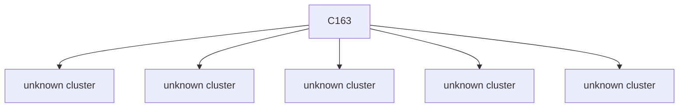
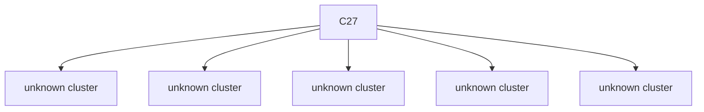

# Semantic RCA Report

---
# Incident I1

## Incident Window
2023-01-27T18:28:08.127428+00:00 → 2023-01-27T18:29:58.127428+00:00

## Root Cause

Cluster: `C163`
Score: 96.49

### Cluster Behavior
system:serviceaccount:gatekeeper-system:gatekeeper-admin list assignmetadata → HTTP 404 (authorization/client errors)

### Trigger Explanation
system:serviceaccount:gatekeeper-system:gatekeeper-admin attempted to list assignmetadata via  resulting in HTTP 404

### Key Signals
- trigger_score: 2.912427
- error_count: 108
- graph_out_weight: 19.449999999999996
- graph_in_weight: 21.899999999999995

### Blast Radius
Affected downstream clusters: **5**

### Trigger / Lag / Lead

- Trigger: system:serviceaccount:gatekeeper-system:gatekeeper-admin list assignmetadata → HTTP 404 (authorization/client errors)
- Lag: unknown cluster ; unknown cluster ; unknown cluster ; unknown cluster ; unknown cluster
- Lead: unknown cluster ; unknown cluster ; unknown cluster ; unknown cluster ; unknown cluster

### Causal Propagation


### Primary Evidence Event
```
"{""name"":""k8s-master-perfspec""}",2023-01-27T18:28:22.470778Z,system:serviceaccount:gatekeeper-system:gatekeeper-admin,list,assignmetadata,,,,/apis/mutations.gatekeeper.sh/v1/assignmetadata?resourceVersion=6135961,2c893351-f825-40f8-9bf7-19ff1de0fb4f,ResponseComplete,404,,,
```

## Other Possible Contributors

| Rank | Cluster | Behavior | Score | Errors |
|------|--------|----------|------|------|
| 2 | C165 | kubernetes-admin delete rolebindings in namespace my-cert-manager-startupapicheck:create-cert → HTTP 200 (successful operations) | 33.87 | 28 |
| 3 | C105 | system:node:k8s-node-2-perfspec watch secrets in namespace gatekeeper-webhook-server-cert → HTTP 403 (authorization/client errors) | 28.08 | 8 |
| 4 | C131 | system:apiserver get serviceaccounts in namespace policy-test-sa-1 → HTTP 404 (authorization/client errors) | 25.76 | 16 |
| 5 | C19 | kubernetes-admin get daemonsets in namespace my-prometheus-prometheus-node-exporter → HTTP 404 (authorization/client errors) | 25.01 | 114 |

---
# Incident I2

## Incident Window
2023-01-27T18:30:58.127428+00:00 → 2023-01-27T18:31:48.127428+00:00

## Root Cause

Cluster: `C27`
Score: 94.36

### Cluster Behavior
system:serviceaccount:kube-system:deployment-controller update deployments in namespace my-argo-cd-argocd-applicationset-controller → HTTP 200 (successful operations)

### Trigger Explanation
system:serviceaccount:kube-system:deployment-controller attempted to update deployments via  resulting in HTTP 200

### Key Signals
- trigger_score: 0.136381
- error_count: 11
- graph_out_weight: 24.709999999999997
- graph_in_weight: 13.759999999999998

### Blast Radius
Affected downstream clusters: **5**

### Trigger / Lag / Lead

- Trigger: system:serviceaccount:kube-system:deployment-controller update deployments in namespace my-argo-cd-argocd-applicationset-controller → HTTP 200 (successful operations)
- Lag: unknown cluster ; unknown cluster ; unknown cluster ; unknown cluster ; unknown cluster
- Lead: unknown cluster ; unknown cluster ; unknown cluster ; unknown cluster ; unknown cluster

### Causal Propagation


### Primary Evidence Event
```
"{""name"":""k8s-master-perfspec""}",2023-01-27T18:31:07.437877Z,system:serviceaccount:kube-system:deployment-controller,update,deployments,status,my-argo-cd-argocd-applicationset-controller,,/apis/apps/v1/namespaces/argo-cd/deployments/my-argo-cd-argocd-applicationset-controller/status,3f3cec5f-6f92-4099-877c-99d409503302,ResponseComplete,200,,,
```

## Other Possible Contributors

| Rank | Cluster | Behavior | Score | Errors |
|------|--------|----------|------|------|
| 2 | C163 | system:serviceaccount:gatekeeper-system:gatekeeper-admin list assignmetadata → HTTP 404 (authorization/client errors) | 71.93 | 108 |
| 3 | C0 | kubernetes-admin get rolebindings in namespace my-argo-cd-argocd-applicationset-controller → HTTP 404 (authorization/client errors) | 47.13 | 90 |
| 4 | C117 | system:node:k8s-node-1-perfspec patch events in namespace my-loki-logs-8mj42.173e3c8107533d12 → HTTP 404 (authorization/client errors) | 31.19 | 4 |
| 5 | C188 | kubernetes-admin get rolebindings in namespace my-kubernetes-dashboard → HTTP 404 (authorization/client errors) | 29.48 | 4 |
