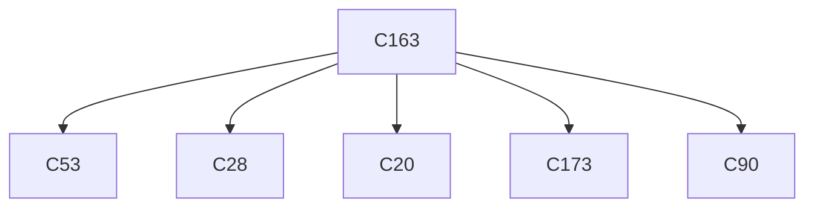

# Semantic RCA Report

---
# Incident I1

## Incident Window
2023-01-27T18:28:08.127428+00:00 → 2023-01-27T18:29:58.127428+00:00

## Root Cause

Cluster: `C163`
Score: 55.86

### Cluster Behavior
system:serviceaccount:gatekeeper-system:gatekeeper-admin list assignmetadata → HTTP 404 (authorization/client errors)

### Trigger Explanation
system:serviceaccount:gatekeeper-system:gatekeeper-admin attempted to list assignmetadata via  resulting in HTTP 404

### Key Signals
- trigger_score: 2.912427
- error_count: 108
- graph_out_weight: 10.95
- graph_in_weight: 5.0

### Blast Radius
Affected downstream clusters: **5**

### Trigger / Lag / Lead

- Trigger: system:serviceaccount:gatekeeper-system:gatekeeper-admin list assignmetadata → HTTP 404 (authorization/client errors)
- Lag: unknown cluster ; unknown cluster ; unknown cluster ; unknown cluster ; unknown cluster
- Lead: unknown cluster ; unknown cluster ; unknown cluster ; unknown cluster ; unknown cluster

### Causal Propagation


### Primary Evidence Event
```
"{""name"":""k8s-master-perfspec""}",2023-01-27T18:28:22.470778Z,system:serviceaccount:gatekeeper-system:gatekeeper-admin,list,assignmetadata,,,,/apis/mutations.gatekeeper.sh/v1/assignmetadata?resourceVersion=6135961,2c893351-f825-40f8-9bf7-19ff1de0fb4f,ResponseComplete,404,,,
```

## Other Possible Contributors

| Rank | Cluster | Behavior | Score | Errors |
|------|--------|----------|------|------|
| 2 | C165 | kubernetes-admin delete rolebindings in namespace my-cert-manager-startupapicheck:create-cert → HTTP 200 (successful operations) | 28.43 | 28 |
| 3 | C19 | kubernetes-admin get daemonsets in namespace my-prometheus-prometheus-node-exporter → HTTP 404 (authorization/client errors) | 25.11 | 114 |
| 4 | C111 | system:node:k8s-node-1-perfspec list configmaps in namespace my-airflow-airflow-config → HTTP 403 (authorization/client errors) | 21.05 | 5 |
| 5 | C131 | system:apiserver get serviceaccounts in namespace policy-test-sa-1 → HTTP 404 (authorization/client errors) | 20.78 | 16 |

---
# Incident I2

## Incident Window
2023-01-27T18:30:58.127428+00:00 → 2023-01-27T18:31:48.127428+00:00

## Root Cause

Cluster: `C0`
Score: 44.46

### Cluster Behavior
kubernetes-admin get rolebindings in namespace my-argo-cd-argocd-applicationset-controller → HTTP 404 (authorization/client errors)

### Trigger Explanation
kubernetes-admin attempted to get rolebindings via  resulting in HTTP 404

### Key Signals
- trigger_score: 4.721854
- error_count: 90
- graph_out_weight: 0.0
- graph_in_weight: 0.0

### Blast Radius
Affected downstream clusters: **0**

### Trigger / Lag / Lead

- Trigger: kubernetes-admin get rolebindings in namespace my-argo-cd-argocd-applicationset-controller → HTTP 404 (authorization/client errors)
- Lag: none detected
- Lead: none detected

### Causal Propagation
No downstream propagation detected.

### Primary Evidence Event
```
"{""name"":""k8s-master-perfspec""}",2023-01-27T18:31:06.032926Z,kubernetes-admin,get,rolebindings,,my-argo-cd-argocd-applicationset-controller,,/apis/rbac.authorization.k8s.io/v1/namespaces/argo-cd/rolebindings/my-argo-cd-argocd-applicationset-controller,ffb58937-bfd6-4945-b8d0-ce40f76d14ba,ResponseComplete,404,,,
```

## Other Possible Contributors

| Rank | Cluster | Behavior | Score | Errors |
|------|--------|----------|------|------|
| 2 | C117 | system:node:k8s-node-1-perfspec patch events in namespace my-loki-logs-8mj42.173e3c8107533d12 → HTTP 404 (authorization/client errors) | 35.38 | 4 |
| 3 | C188 | kubernetes-admin get rolebindings in namespace my-kubernetes-dashboard → HTTP 404 (authorization/client errors) | 27.08 | 4 |
| 4 | C182 | kubernetes-admin create secrets in namespace my-redis → HTTP 201 (successful operations) | 21.97 | 13 |
| 5 | C163 | system:serviceaccount:gatekeeper-system:gatekeeper-admin list assignmetadata → HTTP 404 (authorization/client errors) | 21.87 | 108 |
