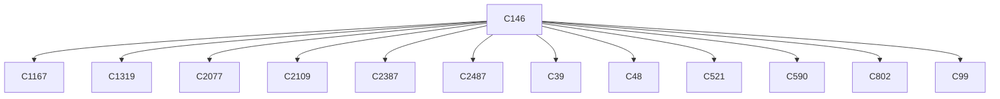
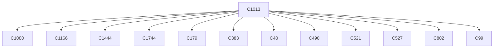
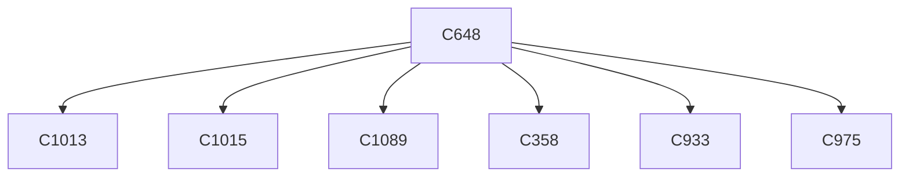

```mermaid
flowchart TD
C1166["C1166"] --> C1006["C1006"]
C1166["C1166"] --> C1058["C1058"]
C1166["C1166"] --> C1080["C1080"]
C1166["C1166"] --> C1083["C1083"]
C1166["C1166"] --> C112["C112"]
C1166["C1166"] --> C1190["C1190"]
C1166["C1166"] --> C128["C128"]
C1166["C1166"] --> C1280["C1280"]
C1166["C1166"] --> C1342["C1342"]
C1166["C1166"] --> C1349["C1349"]
C1166["C1166"] --> C1444["C1444"]
C1166["C1166"] --> C1455["C1455"]
C1166["C1166"] --> C151["C151"]
C1166["C1166"] --> C1555["C1555"]
C1166["C1166"] --> C1619["C1619"]
C1166["C1166"] --> C1744["C1744"]
C1166["C1166"] --> C1779["C1779"]
C1166["C1166"] --> C179["C179"]
C1166["C1166"] --> C182["C182"]
C1166["C1166"] --> C1822["C1822"]
C1166["C1166"] --> C1842["C1842"]
C1166["C1166"] --> C1894["C1894"]
C1166["C1166"] --> C305["C305"]
C1166["C1166"] --> C383["C383"]
C1166["C1166"] --> C39["C39"]
C1166["C1166"] --> C420["C420"]
C1166["C1166"] --> C48["C48"]
C1166["C1166"] --> C49["C49"]
C1166["C1166"] --> C490["C490"]
C1166["C1166"] --> C501["C501"]
C1166["C1166"] --> C521["C521"]
C1166["C1166"] --> C527["C527"]
C1166["C1166"] --> C532["C532"]
C1166["C1166"] --> C570["C570"]
C1166["C1166"] --> C590["C590"]
C1166["C1166"] --> C677["C677"]
C1166["C1166"] --> C70["C70"]
C1166["C1166"] --> C788["C788"]
C1166["C1166"] --> C800["C800"]
C1166["C1166"] --> C802["C802"]
C1166["C1166"] --> C853["C853"]
C1166["C1166"] --> C99["C99"]
```

```mermaid
flowchart TD
C1619["C1619"] --> C1006["C1006"]
C1619["C1619"] --> C1053["C1053"]
C1619["C1619"] --> C1080["C1080"]
C1619["C1619"] --> C1083["C1083"]
C1619["C1619"] --> C1166["C1166"]
C1619["C1619"] --> C1321["C1321"]
C1619["C1619"] --> C1367["C1367"]
C1619["C1619"] --> C1444["C1444"]
C1619["C1619"] --> C1455["C1455"]
C1619["C1619"] --> C1677["C1677"]
C1619["C1619"] --> C1731["C1731"]
C1619["C1619"] --> C1744["C1744"]
C1619["C1619"] --> C1753["C1753"]
C1619["C1619"] --> C179["C179"]
C1619["C1619"] --> C1842["C1842"]
C1619["C1619"] --> C2012["C2012"]
C1619["C1619"] --> C305["C305"]
C1619["C1619"] --> C381["C381"]
C1619["C1619"] --> C39["C39"]
C1619["C1619"] --> C427["C427"]
C1619["C1619"] --> C48["C48"]
C1619["C1619"] --> C490["C490"]
C1619["C1619"] --> C521["C521"]
C1619["C1619"] --> C590["C590"]
C1619["C1619"] --> C677["C677"]
C1619["C1619"] --> C70["C70"]
C1619["C1619"] --> C802["C802"]
C1619["C1619"] --> C941["C941"]
C1619["C1619"] --> C99["C99"]
```

```mermaid
flowchart TD
C1015["C1015"] --> C0["C0"]
C1015["C1015"] --> C1013["C1013"]
C1015["C1015"] --> C1080["C1080"]
C1015["C1015"] --> C112["C112"]
C1015["C1015"] --> C1166["C1166"]
C1015["C1015"] --> C1619["C1619"]
C1015["C1015"] --> C1733["C1733"]
C1015["C1015"] --> C1744["C1744"]
C1015["C1015"] --> C179["C179"]
C1015["C1015"] --> C383["C383"]
C1015["C1015"] --> C39["C39"]
C1015["C1015"] --> C48["C48"]
C1015["C1015"] --> C490["C490"]
C1015["C1015"] --> C524["C524"]
C1015["C1015"] --> C527["C527"]
C1015["C1015"] --> C751["C751"]
C1015["C1015"] --> C788["C788"]
C1015["C1015"] --> C802["C802"]
C1015["C1015"] --> C99["C99"]
```

```mermaid
flowchart TD
C305["C305"] --> C1006["C1006"]
C305["C305"] --> C1053["C1053"]
C305["C305"] --> C1058["C1058"]
C305["C305"] --> C1083["C1083"]
C305["C305"] --> C112["C112"]
C305["C305"] --> C1251["C1251"]
C305["C305"] --> C128["C128"]
C305["C305"] --> C1319["C1319"]
C305["C305"] --> C1611["C1611"]
C305["C305"] --> C1632["C1632"]
C305["C305"] --> C1744["C1744"]
C305["C305"] --> C182["C182"]
C305["C305"] --> C1842["C1842"]
C305["C305"] --> C1894["C1894"]
C305["C305"] --> C1911["C1911"]
C305["C305"] --> C2023["C2023"]
C305["C305"] --> C383["C383"]
C305["C305"] --> C39["C39"]
C305["C305"] --> C420["C420"]
C305["C305"] --> C48["C48"]
C305["C305"] --> C490["C490"]
C305["C305"] --> C521["C521"]
C305["C305"] --> C524["C524"]
C305["C305"] --> C590["C590"]
C305["C305"] --> C677["C677"]
C305["C305"] --> C70["C70"]
C305["C305"] --> C788["C788"]
C305["C305"] --> C802["C802"]
C305["C305"] --> C853["C853"]
C305["C305"] --> C99["C99"]
```

# Semantic RCA Report

---
# Incident I1

## Incident Window
2026-02-17T23:59:59.884238+00:00 → 2026-02-18T00:12:59.534236+00:00

## Root Cause

Cluster: `C1166`
Score: 13.14


Component: mongodb
Failure Mode: normal_operation
Status Class: unknown

Behavior:
mongodb activity

### Cluster Behavior
unknown actor operation resource (unknown outcome)

### Trigger Explanation
 attempted to   via  resulting in HTTP 

### Key Signals
- trigger_score: 0.0
- error_count: 0
- graph_out_weight: 525.6
- graph_in_weight: 66.15

### Blast Radius
Affected downstream clusters: **42**

### Trigger / Lag / Lead

- Trigger: unknown actor operation resource (unknown outcome)
- Lag: unknown cluster ; unknown cluster ; unknown cluster ; unknown cluster ; unknown cluster
- Lead: unknown cluster ; unknown cluster ; unknown cluster ; unknown cluster ; unknown cluster

### Causal Propagation


### Primary Evidence Event
```
mongodb 00:05:09.74 INFO  ==> ** MongoDB Sharded setup finished! **
```

## Other Possible Contributors

| Rank | Cluster | Behavior | Score | Errors |
|------|--------|----------|------|------|
| 2 | C800 | unknown actor operation resource (unknown outcome) | 12.98 | 0 |
| 3 | C1006 | unknown actor operation resource (unknown outcome) | 11.83 | 0 |
| 4 | C532 | unknown actor operation resource (unknown outcome) | 10.41 | 0 |
| 5 | C677 | unknown actor operation resource (unknown outcome) | 9.69 | 0 |

---
# Incident I2

## Incident Window
2026-02-18T00:00:00.227247+00:00 → 2026-02-18T00:12:52.289768+00:00

## Root Cause

Cluster: `C1619`
Score: 15.35


Component: milvus
Failure Mode: normal_operation
Status Class: unknown

Behavior:
proxy activity

### Cluster Behavior
unknown actor operation resource (unknown outcome)

### Trigger Explanation
 attempted to   via  resulting in HTTP 

### Key Signals
- trigger_score: 0.0
- error_count: 0
- graph_out_weight: 109.50000000000001
- graph_in_weight: 0.0

### Blast Radius
Affected downstream clusters: **29**

### Trigger / Lag / Lead

- Trigger: unknown actor operation resource (unknown outcome)
- Lag: unknown cluster ; unknown cluster ; unknown cluster ; unknown cluster ; unknown cluster
- Lead: unknown cluster ; unknown cluster ; unknown cluster ; unknown cluster ; unknown cluster

### Causal Propagation


### Primary Evidence Event
```
[2026/02/18 00:10:36.365 +00:00] [INFO] [resolver/resolver_with_discoverer.go:133] ["new grpc resolver registered"] [component=grpc-resolver] [scheme=milvus-session] [role=milvus/meta/session/rootcoord] [exclusive=true] [id=21]
```

## Other Possible Contributors

| Rank | Cluster | Behavior | Score | Errors |
|------|--------|----------|------|------|
| 2 | C1351 | unknown actor operation resource (unknown outcome) | 12.09 | 0 |
| 3 | C2149 | unknown actor operation resource (unknown outcome) | 12.09 | 0 |
| 4 | C2077 | unknown actor operation resource (unknown outcome) | 11.98 | 0 |
| 5 | C2109 | unknown actor operation resource (unknown outcome) | 11.98 | 0 |

---
# Incident I3

## Incident Window
2026-02-18T00:00:00.029922+00:00 → 2026-02-18T00:12:52.091208+00:00

## Root Cause

Cluster: `C1`
Score: 7.17


Component: Unknown Component
Failure Mode: normal_operation
Status Class: unknown

Behavior:
server activity

### Cluster Behavior
unknown actor operation resource (unknown outcome)

### Trigger Explanation
 attempted to   via  resulting in HTTP 

### Key Signals
- trigger_score: 0.0
- error_count: 0
- graph_out_weight: 0.0
- graph_in_weight: 0.0

### Blast Radius
Affected downstream clusters: **0**

### Trigger / Lag / Lead

- Trigger: unknown actor operation resource (unknown outcome)
- Lag: none detected
- Lead: none detected

### Causal Propagation
No downstream propagation detected.

### Primary Evidence Event
```
2026-02-18T00:11:30.802Z [ERROR] storage.raft: failed to appendEntries to: peer="{Voter cc796202-190e-52be-242d-2222d9293346 vault-2.vault-internal:8201}" error="msgpack decode error [pos 3536]: read tcp 10.42.173.159:43516->10.42.76.232:8201: i/o timeout"
```

---
# Incident I4

## Incident Window
2026-02-18T00:00:00.235139+00:00 → 2026-02-18T00:12:59.734973+00:00

## Root Cause

Cluster: `C146`
Score: 11.03


Component: etcd
Failure Mode: normal_operation
Status Class: unknown

Behavior:
etcd activity

### Cluster Behavior
unknown actor operation resource (unknown outcome)

### Trigger Explanation
 attempted to   via  resulting in HTTP 

### Key Signals
- trigger_score: 0.0
- error_count: 0
- graph_out_weight: 10.950000000000001
- graph_in_weight: 0.0

### Blast Radius
Affected downstream clusters: **12**

### Trigger / Lag / Lead

- Trigger: unknown actor operation resource (unknown outcome)
- Lag: unknown cluster ; unknown cluster ; unknown cluster ; unknown cluster ; unknown cluster
- Lead: unknown cluster ; unknown cluster ; unknown cluster ; unknown cluster ; unknown cluster

### Causal Propagation


### Primary Evidence Event
```
trace[1456590038] linearizableReadLoop
```

## Other Possible Contributors

| Rank | Cluster | Behavior | Score | Errors |
|------|--------|----------|------|------|
| 2 | C66 | unknown actor operation resource (unknown outcome) | 7.71 | 0 |
| 3 | C65 | unknown actor operation resource (unknown outcome) | 7.71 | 0 |
| 4 | C2 | unknown actor operation resource (unknown outcome) | 7.58 | 0 |
| 5 | C88 | unknown actor operation resource (unknown outcome) | 6.52 | 0 |

---
# Incident I5

## Incident Window
2026-02-18T00:00:06.996853+00:00 → 2026-02-18T00:12:45.940965+00:00

## Root Cause

Cluster: `C929`
Score: 7.22


Component: mongodb
Failure Mode: normal_operation
Status Class: unknown

Behavior:
metrics activity

### Cluster Behavior
Servers: [{ Addr: localhost:27017 Type: Unknown Last error: dial tcp [::1]:27017: connect: connection refused } (unknown outcome)

### Trigger Explanation
 Servers: [{ Addr: localhost:27017 attempted to  Type: Unknown  Last error: dial tcp [::1]:27017: connect: connection refused } via  resulting in HTTP 

### Key Signals
- trigger_score: 0.0
- error_count: 0
- graph_out_weight: 0.0
- graph_in_weight: 0.0

### Blast Radius
Affected downstream clusters: **0**

### Trigger / Lag / Lead

- Trigger: Servers: [{ Addr: localhost:27017 Type: Unknown Last error: dial tcp [::1]:27017: connect: connection refused } (unknown outcome)
- Lag: none detected
- Lead: none detected

### Causal Propagation
No downstream propagation detected.

### Primary Evidence Event
```
time="2026-02-18T00:08:40Z" level=error msg="Cannot connect to MongoDB: cannot connect to MongoDB: server selection error: server selection timeout, current topology: { Type: Single, Servers: [{ Addr: localhost:27017, Type: Unknown, Last error: dial tcp [::1]:27017: connect: connection refused }, ] }"
```

---
# Incident I6

## Incident Window
2026-02-17T23:59:41.845137+00:00 → 2026-02-18T00:10:14.093645+00:00

## Root Cause

Cluster: `C1013`
Score: 16.79


Component: mongodb
Failure Mode: normal_operation
Status Class: unknown

Behavior:
utility activity

### Cluster Behavior
Servers: [{ Addr: mongodb-sharded:27017 Type: Unknown Last error: dial tcp 10.43.252.183:27017: connect: connection refused } (unknown outcome)

### Trigger Explanation
 Servers: [{ Addr: mongodb-sharded:27017 attempted to  Type: Unknown  Last error: dial tcp 10.43.252.183:27017: connect: connection refused } via  resulting in HTTP 

### Key Signals
- trigger_score: 0.0
- error_count: 0
- graph_out_weight: 10.949999999999998
- graph_in_weight: 3.0

### Blast Radius
Affected downstream clusters: **12**

### Trigger / Lag / Lead

- Trigger: Servers: [{ Addr: mongodb-sharded:27017 Type: Unknown Last error: dial tcp 10.43.252.183:27017: connect: connection refused } (unknown outcome)
- Lag: unknown cluster ; unknown cluster ; unknown cluster ; unknown cluster ; unknown cluster
- Lead: unknown cluster ; unknown cluster ; unknown cluster ; unknown cluster ; unknown cluster

### Causal Propagation


### Primary Evidence Event
```
2026/02/18 00:10:14 Failed to connect to MongoDB: server selection error: context deadline exceeded, current topology: { Type: Unknown, Servers: [{ Addr: mongodb-sharded:27017, Type: Unknown, Last error: dial tcp 10.43.252.183:27017: connect: connection refused }, ] }
```

## Other Possible Contributors

| Rank | Cluster | Behavior | Score | Errors |
|------|--------|----------|------|------|
| 2 | C358 | and retry (max 10 attempts) operation resource (unknown outcome) | 13.65 | 0 |
| 3 | C933 | unknown actor operation resource (unknown outcome) | 13.65 | 0 |
| 4 | C975 | unknown actor operation resource (unknown outcome) | 13.65 | 0 |
| 5 | C976 | unknown actor operation resource (unknown outcome) | 13.64 | 0 |

---
# Incident I7

## Incident Window
2026-02-17T23:59:40.512419+00:00 → 2026-02-18T00:10:03.763798+00:00

## Root Cause

Cluster: `C1015`
Score: 16.32


Component: mongodb
Failure Mode: normal_operation
Status Class: unknown

Behavior:
policy-engine-chart activity

### Cluster Behavior
Servers: [{ Addr: mongodb-sharded:27017 Type: Unknown Last error: dial tcp 10.43.252.183:27017: connect: connection refused } (unknown outcome)

### Trigger Explanation
 Servers: [{ Addr: mongodb-sharded:27017 attempted to  Type: Unknown  Last error: dial tcp 10.43.252.183:27017: connect: connection refused } via  resulting in HTTP 

### Key Signals
- trigger_score: 0.0
- error_count: 0
- graph_out_weight: 28.849999999999994
- graph_in_weight: 0.0

### Blast Radius
Affected downstream clusters: **19**

### Trigger / Lag / Lead

- Trigger: Servers: [{ Addr: mongodb-sharded:27017 Type: Unknown Last error: dial tcp 10.43.252.183:27017: connect: connection refused } (unknown outcome)
- Lag: unknown cluster ; unknown cluster ; unknown cluster ; unknown cluster ; unknown cluster
- Lead: unknown cluster ; unknown cluster ; unknown cluster ; unknown cluster ; unknown cluster

### Causal Propagation


### Primary Evidence Event
```
2026/02/18 00:04:52 Failed to connect to MongoDB: server selection error: context deadline exceeded, current topology: { Type: Unknown, Servers: [{ Addr: mongodb-sharded:27017, Type: Unknown, Last error: dial tcp 10.43.252.183:27017: connect: connection refused }, ] }
```

## Other Possible Contributors

| Rank | Cluster | Behavior | Score | Errors |
|------|--------|----------|------|------|
| 2 | C1089 | unknown actor operation resource (unknown outcome) | 14.00 | 0 |
| 3 | C1058 | unknown actor operation resource (unknown outcome) | 13.99 | 0 |
| 4 | C1110 | unknown actor operation resource (unknown outcome) | 8.74 | 0 |
| 5 | C394 | and retry (max 10 attempts) operation resource (unknown outcome) | 7.05 | 0 |

---
# Incident I8

## Incident Window
2026-02-18T00:00:09.538476+00:00 → 2026-02-18T00:12:54.543744+00:00

## Root Cause

Cluster: `C183`
Score: 7.19


Component: dcn
Failure Mode: normal_operation
Status Class: unknown

Behavior:
metrics-server activity

### Cluster Behavior
unknown actor operation resource (unknown outcome)

### Trigger Explanation
 attempted to   via  resulting in HTTP 

### Key Signals
- trigger_score: 0.0
- error_count: 0
- graph_out_weight: 0.0
- graph_in_weight: 0.0

### Blast Radius
Affected downstream clusters: **0**

### Trigger / Lag / Lead

- Trigger: unknown actor operation resource (unknown outcome)
- Lag: none detected
- Lead: none detected

### Causal Propagation
No downstream propagation detected.

### Primary Evidence Event
```
E0218 00:06:24.533392       1 scraper.go:149] "Failed to scrape node" err="Get \"https://192.168.113.135:10250/metrics/resource\": dial tcp 192.168.113.135:10250: connect: connection refused" node="sti32-dcn-vsimrtp113-02"
```

---
# Incident I9

## Incident Window
2026-02-17T23:59:16.447354+00:00 → 2026-02-18T00:11:42.798579+00:00

## Root Cause

Cluster: `C648`
Score: 14.36


Component: Unknown Component
Failure Mode: normal_operation
Status Class: unknown

Behavior:
vector-store-chart activity

### Cluster Behavior
unknown actor operation resource (unknown outcome)

### Trigger Explanation
 attempted to   via  resulting in HTTP 

### Key Signals
- trigger_score: 0.0
- error_count: 0
- graph_out_weight: 3.99
- graph_in_weight: 0.0

### Blast Radius
Affected downstream clusters: **6**

### Trigger / Lag / Lead

- Trigger: unknown actor operation resource (unknown outcome)
- Lag: unknown cluster ; unknown cluster ; unknown cluster ; unknown cluster ; unknown cluster
- Lead: unknown cluster ; unknown cluster ; unknown cluster ; unknown cluster ; unknown cluster

### Causal Propagation


### Primary Evidence Event
```
S3Credentials retrieved successfully from k8s secret
```

## Other Possible Contributors

| Rank | Cluster | Behavior | Score | Errors |
|------|--------|----------|------|------|
| 2 | C1053 | unknown actor operation resource (unknown outcome) | 13.28 | 0 |
| 3 | C1051 | unknown actor operation resource (unknown outcome) | 13.06 | 0 |
| 4 | C1087 | unknown actor operation resource (unknown outcome) | 13.06 | 0 |
| 5 | C970 | unknown actor operation resource (unknown outcome) | 13.06 | 0 |

---
# Incident I10

## Incident Window
2026-02-18T00:00:46.039785+00:00 → 2026-02-18T00:11:14.199804+00:00

## Root Cause

Cluster: `C424`
Score: 8.74


Component: Unknown Component
Failure Mode: normal_operation
Status Class: unknown

Behavior:
metadata-chart activity

### Cluster Behavior
and retry (max 10 attempts) operation resource (unknown outcome)

### Trigger Explanation
 and retry (max 10 attempts) attempted to   via  resulting in HTTP 

### Key Signals
- trigger_score: 0.0
- error_count: 0
- graph_out_weight: 0.0
- graph_in_weight: 0.0

### Blast Radius
Affected downstream clusters: **0**

### Trigger / Lag / Lead

- Trigger: and retry (max 10 attempts) operation resource (unknown outcome)
- Lag: none detected
- Lead: none detected

### Causal Propagation
No downstream propagation detected.

### Primary Evidence Event
```
[job.JobService] Created gRPC connection to job-tracker:9090 with load balancing, keepalive (1m30s), and retry (max 10 attempts)
```

## Other Possible Contributors

| Rank | Cluster | Behavior | Score | Errors |
|------|--------|----------|------|------|
| 2 | C1046 | Servers: [{ Addr: mongodb-sharded:27017 Type: Unknown Last error: dial tcp 10.43.252.183:27017: connect: connection refused } (unknown outcome) | 8.07 | 0 |
| 3 | C1022 | unknown actor operation resource (unknown outcome) | 7.05 | 0 |
| 4 | C1090 | unknown actor operation resource (unknown outcome) | 7.05 | 0 |
| 5 | C1169 | unknown actor operation resource (unknown outcome) | 7.05 | 0 |

---
# Incident I11

## Incident Window
2026-02-18T00:00:25.564343+00:00 → 2026-02-18T00:09:27.390826+00:00

## Root Cause

Cluster: `C305`
Score: 15.41


Component: Unknown Component
Failure Mode: normal_operation
Status Class: unknown

Behavior:
ontap-monitor-chart activity

### Cluster Behavior
unknown actor operation resource (unknown outcome)

### Trigger Explanation
 attempted to   via  resulting in HTTP 

### Key Signals
- trigger_score: 0.0
- error_count: 0
- graph_out_weight: 131.39999999999998
- graph_in_weight: 0.0

### Blast Radius
Affected downstream clusters: **30**

### Trigger / Lag / Lead

- Trigger: unknown actor operation resource (unknown outcome)
- Lag: unknown cluster ; unknown cluster ; unknown cluster ; unknown cluster ; unknown cluster
- Lead: unknown cluster ; unknown cluster ; unknown cluster ; unknown cluster ; unknown cluster

### Causal Propagation


### Primary Evidence Event
```
Failed to connect to ONTAP AMQP: read tcp 10.42.7.217:32784->192.168.113.98:5668: read: connection reset by peer
```

## Other Possible Contributors

| Rank | Cluster | Behavior | Score | Errors |
|------|--------|----------|------|------|
| 2 | C1052 | unknown actor operation resource (unknown outcome) | 8.87 | 0 |
| 3 | C1084 | unknown actor operation resource (unknown outcome) | 6.87 | 0 |
| 4 | C1085 | unknown actor operation resource (unknown outcome) | 6.87 | 0 |
| 5 | C326 | and retry (max 10 attempts) operation resource (unknown outcome) | 6.87 | 0 |
