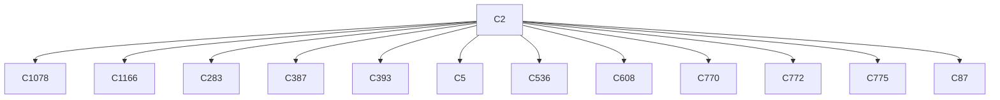
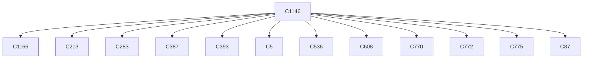
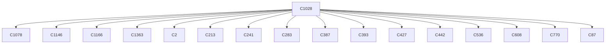

```mermaid
flowchart TD
C1166["C1166"] --> C1021["C1021"]
C1166["C1166"] --> C1051["C1051"]
C1166["C1166"] --> C1078["C1078"]
C1166["C1166"] --> C1108["C1108"]
C1166["C1166"] --> C1152["C1152"]
C1166["C1166"] --> C1168["C1168"]
C1166["C1166"] --> C1185["C1185"]
C1166["C1166"] --> C1228["C1228"]
C1166["C1166"] --> C1242["C1242"]
C1166["C1166"] --> C1352["C1352"]
C1166["C1166"] --> C1445["C1445"]
C1166["C1166"] --> C1466["C1466"]
C1166["C1166"] --> C1491["C1491"]
C1166["C1166"] --> C1496["C1496"]
C1166["C1166"] --> C151["C151"]
C1166["C1166"] --> C1557["C1557"]
C1166["C1166"] --> C1703["C1703"]
C1166["C1166"] --> C1719["C1719"]
C1166["C1166"] --> C2["C2"]
C1166["C1166"] --> C213["C213"]
C1166["C1166"] --> C2203["C2203"]
C1166["C1166"] --> C2212["C2212"]
C1166["C1166"] --> C2268["C2268"]
C1166["C1166"] --> C2306["C2306"]
C1166["C1166"] --> C2344["C2344"]
C1166["C1166"] --> C237["C237"]
C1166["C1166"] --> C2471["C2471"]
C1166["C1166"] --> C2570["C2570"]
C1166["C1166"] --> C275["C275"]
C1166["C1166"] --> C283["C283"]
C1166["C1166"] --> C355["C355"]
C1166["C1166"] --> C363["C363"]
C1166["C1166"] --> C38["C38"]
C1166["C1166"] --> C393["C393"]
C1166["C1166"] --> C402["C402"]
C1166["C1166"] --> C46["C46"]
C1166["C1166"] --> C499["C499"]
C1166["C1166"] --> C5["C5"]
C1166["C1166"] --> C500["C500"]
C1166["C1166"] --> C501["C501"]
C1166["C1166"] --> C536["C536"]
C1166["C1166"] --> C571["C571"]
C1166["C1166"] --> C592["C592"]
C1166["C1166"] --> C656["C656"]
C1166["C1166"] --> C68["C68"]
C1166["C1166"] --> C703["C703"]
C1166["C1166"] --> C724["C724"]
C1166["C1166"] --> C725["C725"]
C1166["C1166"] --> C728["C728"]
C1166["C1166"] --> C749["C749"]
C1166["C1166"] --> C770["C770"]
C1166["C1166"] --> C772["C772"]
C1166["C1166"] --> C773["C773"]
C1166["C1166"] --> C775["C775"]
C1166["C1166"] --> C78["C78"]
C1166["C1166"] --> C809["C809"]
C1166["C1166"] --> C864["C864"]
C1166["C1166"] --> C87["C87"]
C1166["C1166"] --> C893["C893"]
C1166["C1166"] --> C90["C90"]
C1166["C1166"] --> C915["C915"]
C1166["C1166"] --> C919["C919"]
C1166["C1166"] --> C923["C923"]
C1166["C1166"] --> C927["C927"]
C1166["C1166"] --> C944["C944"]
C1166["C1166"] --> C966["C966"]
```

```mermaid
flowchart TD
C2344["C2344"] --> C1021["C1021"]
C2344["C2344"] --> C1051["C1051"]
C2344["C2344"] --> C1078["C1078"]
C2344["C2344"] --> C1166["C1166"]
C2344["C2344"] --> C1185["C1185"]
C2344["C2344"] --> C1228["C1228"]
C2344["C2344"] --> C1242["C1242"]
C2344["C2344"] --> C1445["C1445"]
C2344["C2344"] --> C1466["C1466"]
C2344["C2344"] --> C1491["C1491"]
C2344["C2344"] --> C1496["C1496"]
C2344["C2344"] --> C151["C151"]
C2344["C2344"] --> C1557["C1557"]
C2344["C2344"] --> C1664["C1664"]
C2344["C2344"] --> C1702["C1702"]
C2344["C2344"] --> C1703["C1703"]
C2344["C2344"] --> C2["C2"]
C2344["C2344"] --> C213["C213"]
C2344["C2344"] --> C2203["C2203"]
C2344["C2344"] --> C2212["C2212"]
C2344["C2344"] --> C2268["C2268"]
C2344["C2344"] --> C2306["C2306"]
C2344["C2344"] --> C237["C237"]
C2344["C2344"] --> C2471["C2471"]
C2344["C2344"] --> C2570["C2570"]
C2344["C2344"] --> C275["C275"]
C2344["C2344"] --> C283["C283"]
C2344["C2344"] --> C38["C38"]
C2344["C2344"] --> C393["C393"]
C2344["C2344"] --> C46["C46"]
C2344["C2344"] --> C499["C499"]
C2344["C2344"] --> C5["C5"]
C2344["C2344"] --> C500["C500"]
C2344["C2344"] --> C536["C536"]
C2344["C2344"] --> C571["C571"]
C2344["C2344"] --> C580["C580"]
C2344["C2344"] --> C592["C592"]
C2344["C2344"] --> C656["C656"]
C2344["C2344"] --> C703["C703"]
C2344["C2344"] --> C724["C724"]
C2344["C2344"] --> C725["C725"]
C2344["C2344"] --> C749["C749"]
C2344["C2344"] --> C770["C770"]
C2344["C2344"] --> C772["C772"]
C2344["C2344"] --> C773["C773"]
C2344["C2344"] --> C78["C78"]
C2344["C2344"] --> C87["C87"]
C2344["C2344"] --> C893["C893"]
C2344["C2344"] --> C90["C90"]
C2344["C2344"] --> C915["C915"]
C2344["C2344"] --> C923["C923"]
C2344["C2344"] --> C927["C927"]
C2344["C2344"] --> C944["C944"]
C2344["C2344"] --> C966["C966"]
```

```mermaid
flowchart TD
C809["C809"] --> C10["C10"]
C809["C809"] --> C100["C100"]
C809["C809"] --> C1051["C1051"]
C809["C809"] --> C1078["C1078"]
C809["C809"] --> C1152["C1152"]
C809["C809"] --> C1166["C1166"]
C809["C809"] --> C1168["C1168"]
C809["C809"] --> C1228["C1228"]
C809["C809"] --> C1237["C1237"]
C809["C809"] --> C1242["C1242"]
C809["C809"] --> C1331["C1331"]
C809["C809"] --> C1374["C1374"]
C809["C809"] --> C170["C170"]
C809["C809"] --> C1733["C1733"]
C809["C809"] --> C177["C177"]
C809["C809"] --> C1918["C1918"]
C809["C809"] --> C1922["C1922"]
C809["C809"] --> C1992["C1992"]
C809["C809"] --> C2053["C2053"]
C809["C809"] --> C213["C213"]
C809["C809"] --> C2203["C2203"]
C809["C809"] --> C2344["C2344"]
C809["C809"] --> C2570["C2570"]
C809["C809"] --> C283["C283"]
C809["C809"] --> C301["C301"]
C809["C809"] --> C38["C38"]
C809["C809"] --> C387["C387"]
C809["C809"] --> C402["C402"]
C809["C809"] --> C423["C423"]
C809["C809"] --> C46["C46"]
C809["C809"] --> C465["C465"]
C809["C809"] --> C500["C500"]
C809["C809"] --> C501["C501"]
C809["C809"] --> C580["C580"]
C809["C809"] --> C648["C648"]
C809["C809"] --> C68["C68"]
C809["C809"] --> C69["C69"]
C809["C809"] --> C725["C725"]
C809["C809"] --> C728["C728"]
C809["C809"] --> C733["C733"]
C809["C809"] --> C770["C770"]
C809["C809"] --> C772["C772"]
C809["C809"] --> C775["C775"]
C809["C809"] --> C78["C78"]
C809["C809"] --> C857["C857"]
C809["C809"] --> C87["C87"]
C809["C809"] --> C919["C919"]
C809["C809"] --> C923["C923"]
C809["C809"] --> C960["C960"]
```

```mermaid
flowchart TD
C923["C923"] --> C10["C10"]
C923["C923"] --> C100["C100"]
C923["C923"] --> C1025["C1025"]
C923["C923"] --> C1051["C1051"]
C923["C923"] --> C1078["C1078"]
C923["C923"] --> C1082["C1082"]
C923["C923"] --> C1106["C1106"]
C923["C923"] --> C1108["C1108"]
C923["C923"] --> C1118["C1118"]
C923["C923"] --> C1152["C1152"]
C923["C923"] --> C1166["C1166"]
C923["C923"] --> C1168["C1168"]
C923["C923"] --> C1209["C1209"]
C923["C923"] --> C1228["C1228"]
C923["C923"] --> C1237["C1237"]
C923["C923"] --> C125["C125"]
C923["C923"] --> C1284["C1284"]
C923["C923"] --> C1324["C1324"]
C923["C923"] --> C1331["C1331"]
C923["C923"] --> C1397["C1397"]
C923["C923"] --> C1512["C1512"]
C923["C923"] --> C16["C16"]
C923["C923"] --> C1603["C1603"]
C923["C923"] --> C1664["C1664"]
C923["C923"] --> C1702["C1702"]
C923["C923"] --> C1719["C1719"]
C923["C923"] --> C1736["C1736"]
C923["C923"] --> C19["C19"]
C923["C923"] --> C1918["C1918"]
C923["C923"] --> C1922["C1922"]
C923["C923"] --> C1958["C1958"]
C923["C923"] --> C1968["C1968"]
C923["C923"] --> C1999["C1999"]
C923["C923"] --> C2016["C2016"]
C923["C923"] --> C2036["C2036"]
C923["C923"] --> C2039["C2039"]
C923["C923"] --> C2052["C2052"]
C923["C923"] --> C2053["C2053"]
C923["C923"] --> C213["C213"]
C923["C923"] --> C2203["C2203"]
C923["C923"] --> C226["C226"]
C923["C923"] --> C2344["C2344"]
C923["C923"] --> C2471["C2471"]
C923["C923"] --> C257["C257"]
C923["C923"] --> C2570["C2570"]
C923["C923"] --> C283["C283"]
C923["C923"] --> C301["C301"]
C923["C923"] --> C38["C38"]
C923["C923"] --> C387["C387"]
C923["C923"] --> C393["C393"]
C923["C923"] --> C46["C46"]
C923["C923"] --> C465["C465"]
C923["C923"] --> C5["C5"]
C923["C923"] --> C500["C500"]
C923["C923"] --> C501["C501"]
C923["C923"] --> C520["C520"]
C923["C923"] --> C536["C536"]
C923["C923"] --> C580["C580"]
C923["C923"] --> C6["C6"]
C923["C923"] --> C68["C68"]
C923["C923"] --> C703["C703"]
C923["C923"] --> C725["C725"]
C923["C923"] --> C728["C728"]
C923["C923"] --> C737["C737"]
C923["C923"] --> C770["C770"]
C923["C923"] --> C772["C772"]
C923["C923"] --> C775["C775"]
C923["C923"] --> C78["C78"]
C923["C923"] --> C809["C809"]
C923["C923"] --> C857["C857"]
C923["C923"] --> C864["C864"]
C923["C923"] --> C87["C87"]
C923["C923"] --> C890["C890"]
C923["C923"] --> C919["C919"]
C923["C923"] --> C960["C960"]
```

# Semantic RCA Report

---
# Incident I1

## Incident Window
2026-02-17T23:59:59.884238+00:00 → 2026-02-18T00:12:59.534236+00:00

## Root Cause

Cluster: `C1166`
Score: 16.41


Component: Unknown Component
Failure Mode: normal_operation
Status Class: unknown

Behavior:
mongodb activity

### Cluster Behavior
unknown actor operation resource (unknown outcome)

### Trigger Explanation
 attempted to   via  resulting in HTTP 

### Key Signals
- trigger_score: 0.0
- error_count: 0
- graph_out_weight: 615.11
- graph_in_weight: 118.07999999999997

### Blast Radius
Affected downstream clusters: **66**

### Trigger / Lag / Lead

- Trigger: unknown actor operation resource (unknown outcome)
- Lag: unknown cluster ; unknown cluster ; unknown cluster ; unknown cluster ; unknown cluster
- Lead: unknown cluster ; unknown cluster ; unknown cluster ; unknown cluster ; unknown cluster

### Causal Propagation


### Primary Evidence Event
```
Error receiving request from client. Ending connection from remote
```

## Other Possible Contributors

| Rank | Cluster | Behavior | Score | Errors |
|------|--------|----------|------|------|
| 2 | C770 | unknown actor operation resource (unknown outcome) | 15.95 | 0 |
| 3 | C427 | unknown actor operation resource (unknown outcome) | 15.61 | 0 |
| 4 | C681 | unknown actor operation resource (unknown outcome) | 14.71 | 0 |
| 5 | C1228 | unknown actor operation resource (unknown outcome) | 14.09 | 0 |

---
# Incident I2

## Incident Window
2026-02-18T00:00:00.227247+00:00 → 2026-02-18T00:12:52.289768+00:00

## Root Cause

Cluster: `C2344`
Score: 13.32


Component: Unknown Component
Failure Mode: normal_operation
Status Class: unknown

Behavior:
proxy activity

### Cluster Behavior
unknown actor operation resource (unknown outcome)

### Trigger Explanation
 attempted to   via  resulting in HTTP 

### Key Signals
- trigger_score: 0.0
- error_count: 0
- graph_out_weight: 336.7799999999999
- graph_in_weight: 15.29

### Blast Radius
Affected downstream clusters: **54**

### Trigger / Lag / Lead

- Trigger: unknown actor operation resource (unknown outcome)
- Lag: unknown cluster ; unknown cluster ; unknown cluster ; unknown cluster ; unknown cluster
- Lead: unknown cluster ; unknown cluster ; unknown cluster ; unknown cluster ; unknown cluster

### Causal Propagation


### Primary Evidence Event
```
goroutine 5 gp=0xc000003dc0 m=nil [GC worker (idle), 10 minutes]:
```

## Other Possible Contributors

| Rank | Cluster | Behavior | Score | Errors |
|------|--------|----------|------|------|
| 2 | C275 | stream:"stderr" _p:"F" log:"" in namespace namespace_name:"aide-system" via pod_id:"e6707083-0971-454f-8f38-2acc6ce64dc0" → HTTP app.kubernetes.io/name:"milvus" (unknown outcome) | 12.47 | 0 |
| 3 | C2570 | unknown actor operation resource (unknown outcome) | 12.12 | 0 |
| 4 | C2471 | unknown actor operation resource (unknown outcome) | 12.12 | 0 |
| 5 | C2203 | unknown actor operation resource (unknown outcome) | 12.12 | 0 |

---
# Incident I3

## Incident Window
2026-02-18T00:00:00.029922+00:00 → 2026-02-18T00:12:52.091208+00:00

## Root Cause

Cluster: `C2`
Score: 17.75


Component: Unknown Component
Failure Mode: normal_operation
Status Class: unknown

Behavior:
server activity

### Cluster Behavior
unknown actor operation resource (unknown outcome)

### Trigger Explanation
 attempted to   via  resulting in HTTP 

### Key Signals
- trigger_score: 0.0
- error_count: 0
- graph_out_weight: 10.95
- graph_in_weight: 0.0

### Blast Radius
Affected downstream clusters: **12**

### Trigger / Lag / Lead

- Trigger: unknown actor operation resource (unknown outcome)
- Lag: unknown cluster ; unknown cluster ; unknown cluster ; unknown cluster ; unknown cluster
- Lead: unknown cluster ; unknown cluster ; unknown cluster ; unknown cluster ; unknown cluster

### Causal Propagation


### Primary Evidence Event
```
2026-02-18T00:12:31.750Z [ERROR] storage.raft: failed to appendEntries to: peer="{Voter cc796202-190e-52be-242d-2222d9293346 vault-2.vault-internal:8201}" error="msgpack decode error [pos 3672]: read tcp 10.42.173.159:38978->10.42.76.232:8201: i/o timeout"
```

---
# Incident I4

## Incident Window
2026-02-18T00:00:00.235139+00:00 → 2026-02-18T00:12:59.734973+00:00

## Root Cause

Cluster: `C80`
Score: 7.71


Component: etcd
Failure Mode: normal_operation
Status Class: unknown

Behavior:
etcd activity

### Cluster Behavior
unknown actor operation resource (unknown outcome)

### Trigger Explanation
 attempted to   via  resulting in HTTP 

### Key Signals
- trigger_score: 0.0
- error_count: 0
- graph_out_weight: 0.0
- graph_in_weight: 0.0

### Blast Radius
Affected downstream clusters: **0**

### Trigger / Lag / Lead

- Trigger: unknown actor operation resource (unknown outcome)
- Lag: none detected
- Lead: none detected

### Causal Propagation
No downstream propagation detected.

### Primary Evidence Event
```
failed to reach the peer URL
```

## Other Possible Contributors

| Rank | Cluster | Behavior | Score | Errors |
|------|--------|----------|------|------|
| 2 | C79 | unknown actor operation resource (unknown outcome) | 7.71 | 0 |
| 3 | C11 | unknown actor operation resource (unknown outcome) | 7.58 | 0 |
| 4 | C114 | unknown actor operation resource (unknown outcome) | 6.52 | 0 |
| 5 | C115 | unknown actor operation resource (unknown outcome) | 6.06 | 0 |

---
# Incident I5

## Incident Window
2026-02-18T00:00:06.996853+00:00 → 2026-02-18T00:12:45.940965+00:00

## Root Cause

Cluster: `C1078`
Score: 17.80


Component: mongodb
Failure Mode: normal_operation
Status Class: unknown

Behavior:
metrics activity

### Cluster Behavior
Servers: [{ Addr: localhost:27017 Type: Unknown Last error: dial tcp [::1]:27017: connect: connection refused } (unknown outcome)

### Trigger Explanation
 Servers: [{ Addr: localhost:27017 attempted to  Type: Unknown  Last error: dial tcp [::1]:27017: connect: connection refused } via  resulting in HTTP 

### Key Signals
- trigger_score: 0.0
- error_count: 0
- graph_out_weight: 1647.6100000000006
- graph_in_weight: 0.0

### Blast Radius
Affected downstream clusters: **125**

### Trigger / Lag / Lead

- Trigger: Servers: [{ Addr: localhost:27017 Type: Unknown Last error: dial tcp [::1]:27017: connect: connection refused } (unknown outcome)
- Lag: unknown cluster ; unknown cluster ; unknown cluster ; unknown cluster ; unknown cluster
- Lead: unknown cluster ; unknown cluster ; unknown cluster ; unknown cluster ; unknown cluster

### Causal Propagation


### Primary Evidence Event
```
time="2026-02-18T00:06:36Z" level=error msg="Cannot connect to MongoDB: cannot connect to MongoDB: server selection error: server selection timeout, current topology: { Type: Single, Servers: [{ Addr: localhost:27017, Type: Unknown, Last error: dial tcp [::1]:27017: connect: connection refused }, ] }"
```

---
# Incident I6

## Incident Window
2026-02-17T23:59:41.845137+00:00 → 2026-02-18T00:10:14.093645+00:00

## Root Cause

Cluster: `C1146`
Score: 16.92


Component: mongodb
Failure Mode: normal_operation
Status Class: unknown

Behavior:
utility activity

### Cluster Behavior
Servers: [{ Addr: mongodb-sharded:27017 Type: Unknown Last error: dial tcp 10.43.252.183:27017: connect: connection refused } (unknown outcome)

### Trigger Explanation
 Servers: [{ Addr: mongodb-sharded:27017 attempted to  Type: Unknown  Last error: dial tcp 10.43.252.183:27017: connect: connection refused } via  resulting in HTTP 

### Key Signals
- trigger_score: 0.0
- error_count: 0
- graph_out_weight: 10.95
- graph_in_weight: 2.0

### Blast Radius
Affected downstream clusters: **12**

### Trigger / Lag / Lead

- Trigger: Servers: [{ Addr: mongodb-sharded:27017 Type: Unknown Last error: dial tcp 10.43.252.183:27017: connect: connection refused } (unknown outcome)
- Lag: unknown cluster ; unknown cluster ; unknown cluster ; unknown cluster ; unknown cluster
- Lead: unknown cluster ; unknown cluster ; unknown cluster ; unknown cluster ; unknown cluster

### Causal Propagation


### Primary Evidence Event
```
2026/02/18 00:10:14 Failed to connect to MongoDB: server selection error: context deadline exceeded, current topology: { Type: Unknown, Servers: [{ Addr: mongodb-sharded:27017, Type: Unknown, Last error: dial tcp 10.43.252.183:27017: connect: connection refused }, ] }
```

## Other Possible Contributors

| Rank | Cluster | Behavior | Score | Errors |
|------|--------|----------|------|------|
| 2 | C406 | and retry (max 10 attempts) operation resource (unknown outcome) | 13.77 | 0 |
| 3 | C815 | unknown actor operation resource (unknown outcome) | 13.77 | 0 |
| 4 | C842 | unknown actor operation resource (unknown outcome) | 13.77 | 0 |
| 5 | C843 | unknown actor operation resource (unknown outcome) | 13.77 | 0 |

---
# Incident I7

## Incident Window
2026-02-17T23:59:40.512419+00:00 → 2026-02-18T00:10:03.763798+00:00

## Root Cause

Cluster: `C1028`
Score: 15.42


Component: Unknown Component
Failure Mode: normal_operation
Status Class: unknown

Behavior:
policy-engine-chart activity

### Cluster Behavior
unknown actor operation resource (unknown outcome)

### Trigger Explanation
 attempted to   via  resulting in HTTP 

### Key Signals
- trigger_score: 0.0
- error_count: 0
- graph_out_weight: 17.900000000000002
- graph_in_weight: 0.0

### Blast Radius
Affected downstream clusters: **16**

### Trigger / Lag / Lead

- Trigger: unknown actor operation resource (unknown outcome)
- Lag: unknown cluster ; unknown cluster ; unknown cluster ; unknown cluster ; unknown cluster
- Lead: unknown cluster ; unknown cluster ; unknown cluster ; unknown cluster ; unknown cluster

### Causal Propagation


### Primary Evidence Event
```
Initializing health probes
```

## Other Possible Contributors

| Rank | Cluster | Behavior | Score | Errors |
|------|--------|----------|------|------|
| 2 | C961 | unknown actor operation resource (unknown outcome) | 14.13 | 0 |
| 3 | C960 | unknown actor operation resource (unknown outcome) | 13.42 | 0 |
| 4 | C1148 | Servers: [{ Addr: mongodb-sharded:27017 Type: Unknown Last error: dial tcp 10.43.252.183:27017: connect: connection refused } (unknown outcome) | 8.07 | 0 |
| 5 | C428 | and retry (max 10 attempts) operation resource (unknown outcome) | 7.05 | 0 |

---
# Incident I8

## Incident Window
2026-02-18T00:00:09.538476+00:00 → 2026-02-18T00:12:54.543744+00:00

## Root Cause

Cluster: `C66`
Score: 7.19


Component: dcn
Failure Mode: normal_operation
Status Class: unknown

Behavior:
metrics-server activity

### Cluster Behavior
unknown actor operation resource (unknown outcome)

### Trigger Explanation
 attempted to   via  resulting in HTTP 

### Key Signals
- trigger_score: 0.0
- error_count: 0
- graph_out_weight: 0.0
- graph_in_weight: 0.0

### Blast Radius
Affected downstream clusters: **0**

### Trigger / Lag / Lead

- Trigger: unknown actor operation resource (unknown outcome)
- Lag: none detected
- Lead: none detected

### Causal Propagation
No downstream propagation detected.

### Primary Evidence Event
```
E0218 00:08:54.532825       1 scraper.go:149] "Failed to scrape node" err="Get \"https://192.168.113.135:10250/metrics/resource\": dial tcp 192.168.113.135:10250: connect: connection refused" node="sti32-dcn-vsimrtp113-02"
```

---
# Incident I9

## Incident Window
2026-02-17T23:59:16.447354+00:00 → 2026-02-18T00:11:42.798579+00:00

## Root Cause

Cluster: `C809`
Score: 14.13


Component: mongodb
Failure Mode: normal_operation
Status Class: unknown

Behavior:
vector-store-chart activity

### Cluster Behavior
etc.) operation resource (unknown outcome)

### Trigger Explanation
 etc.) attempted to   via  resulting in HTTP 

### Key Signals
- trigger_score: 0.0
- error_count: 0
- graph_out_weight: 394.2
- graph_in_weight: 0.0

### Blast Radius
Affected downstream clusters: **49**

### Trigger / Lag / Lead

- Trigger: etc.) operation resource (unknown outcome)
- Lag: unknown cluster ; unknown cluster ; unknown cluster ; unknown cluster ; unknown cluster
- Lead: unknown cluster ; unknown cluster ; unknown cluster ; unknown cluster ; unknown cluster

### Causal Propagation


### Primary Evidence Event
```
Initializing vector store services (Milvus, MongoDB, etc.)
```

## Other Possible Contributors

| Rank | Cluster | Behavior | Score | Errors |
|------|--------|----------|------|------|
| 2 | C864 | unknown actor operation resource (unknown outcome) | 14.13 | 0 |
| 3 | C890 | unknown actor operation resource (unknown outcome) | 14.13 | 0 |
| 4 | C958 | unknown actor operation resource (unknown outcome) | 13.17 | 0 |
| 5 | C959 | unknown actor operation resource (unknown outcome) | 13.17 | 0 |

---
# Incident I10

## Incident Window
2026-02-18T00:00:46.039785+00:00 → 2026-02-18T00:11:14.199804+00:00

## Root Cause

Cluster: `C923`
Score: 14.13


Component: Unknown Component
Failure Mode: normal_operation
Status Class: unknown

Behavior:
metadata-chart activity

### Cluster Behavior
unknown actor operation resource (unknown outcome)

### Trigger Explanation
 attempted to   via  resulting in HTTP 

### Key Signals
- trigger_score: 0.0
- error_count: 0
- graph_out_weight: 711.7500000000002
- graph_in_weight: 0.0

### Blast Radius
Affected downstream clusters: **75**

### Trigger / Lag / Lead

- Trigger: unknown actor operation resource (unknown outcome)
- Lag: unknown cluster ; unknown cluster ; unknown cluster ; unknown cluster ; unknown cluster
- Lead: unknown cluster ; unknown cluster ; unknown cluster ; unknown cluster ; unknown cluster

### Causal Propagation


### Primary Evidence Event
```
HTTP server is ready and accepting connections
```

## Other Possible Contributors

| Rank | Cluster | Behavior | Score | Errors |
|------|--------|----------|------|------|
| 2 | C1079 | unknown actor operation resource (unknown outcome) | 13.42 | 0 |
| 3 | C455 | and retry (max 10 attempts) operation resource (unknown outcome) | 8.74 | 0 |
| 4 | C1171 | Servers: [{ Addr: mongodb-sharded:27017 Type: Unknown Last error: dial tcp 10.43.252.183:27017: connect: connection refused } (unknown outcome) | 8.07 | 0 |
| 5 | C1031 | unknown actor operation resource (unknown outcome) | 7.05 | 0 |

---
# Incident I11

## Incident Window
2026-02-18T00:00:25.564343+00:00 → 2026-02-18T00:09:27.390826+00:00

## Root Cause

Cluster: `C957`
Score: 8.87


Component: Unknown Component
Failure Mode: normal_operation
Status Class: unknown

Behavior:
ontap-monitor-chart activity

### Cluster Behavior
unknown actor operation resource (unknown outcome)

### Trigger Explanation
 attempted to   via  resulting in HTTP 

### Key Signals
- trigger_score: 0.0
- error_count: 0
- graph_out_weight: 0.0
- graph_in_weight: 0.0

### Blast Radius
Affected downstream clusters: **0**

### Trigger / Lag / Lead

- Trigger: unknown actor operation resource (unknown outcome)
- Lag: none detected
- Lead: none detected

### Causal Propagation
No downstream propagation detected.

### Primary Evidence Event
```
Health check endpoints registered
```

## Other Possible Contributors

| Rank | Cluster | Behavior | Score | Errors |
|------|--------|----------|------|------|
| 2 | C373 | and retry (max 10 attempts) operation resource (unknown outcome) | 6.87 | 0 |
| 3 | C557 | unknown actor operation resource (unknown outcome) | 6.87 | 0 |
| 4 | C841 | unknown actor operation resource (unknown outcome) | 6.87 | 0 |
| 5 | C920 | unknown actor operation resource (unknown outcome) | 6.87 | 0 |
