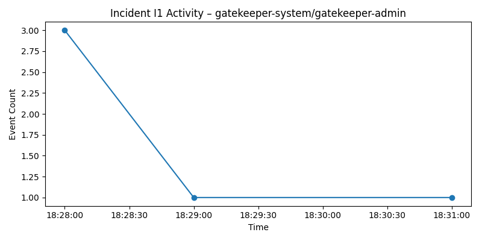

# Semantic RCA Report

## Incident Window

2023-01-27T18:28:08.127428+00:00 → 2023-01-27T18:32:08.127428+00:00

Incident Severity: **Low**

Incident Type: **Operational anomaly**

---

## Incident Relationships

Classification: Primary incident

---

## Primary Trigger

Timestamp: 2023-01-27T18:28:11.027814Z
Actor: system:serviceaccount:gatekeeper-system:gatekeeper-admin
Action: list constrainttemplates
Response: HTTP 404

---

## Root Cause Candidate

Component: **gatekeeper-system/gatekeeper-admin**

### Cluster Behavior

gatekeeper-system/gatekeeper-admin operation resource → HTTP 404 (authorization/client errors)

Detected **18 anomalous events** (trigger_score=3.003702).

Confidence: **medium** (0.722)

---

## Representative Failure

Timestamp: 2023-01-27T18:30:03.978005Z
Actor: system:serviceaccount:gatekeeper-system:gatekeeper-admin
Action: list constrainttemplates
Response: HTTP 404

---

## Error Distribution

4xx: 18

---

## Propagation Chain

system:kube-scheduler → gatekeeper-system/gatekeeper-admin → kubernetes-admin

---

## Propagation Delays

system:kube-scheduler → gatekeeper-system/gatekeeper-admin : 2s
gatekeeper-system/gatekeeper-admin → gatekeeper-system/gatekeeper-admin : 2s
gatekeeper-system/gatekeeper-admin → kubernetes-admin : 101s
kubernetes-admin → kubernetes-admin : 70s

---

## Failure Timeline

2023-01-27T18:28:08.140723Z — system:kube-scheduler (HTTP 403)
2023-01-27T18:28:11.027814Z — gatekeeper-system/gatekeeper-admin (HTTP 404)
2023-01-27T18:28:13.358903Z — gatekeeper-system/gatekeeper-admin (HTTP 404)
2023-01-27T18:29:55.101864Z — kubernetes-admin (HTTP 404)
2023-01-27T18:31:05.897828Z — kubernetes-admin (HTTP 404)

---

## Confidence Reasoning

- cluster exhibits highest trigger anomaly score
- cluster contains largest burst of error responses
- events occur earliest in incident timeline

---

## Deterministic Conclusion

The earliest anomaly burst originates from **gatekeeper-system/gatekeeper-admin**, described as: **gatekeeper-system/gatekeeper-admin operation resource → HTTP 404 (authorization/client errors)**. Temporal ordering and error concentration identify this component as the most probable origin of the incident.
