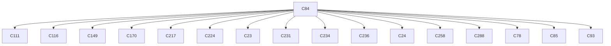

# Semantic RCA Report

---
# Incident I1

## Incident Window
2023-01-27T18:28:08.127428+00:00 → 2023-01-27T18:29:18.127428+00:00

## Root Cause

Cluster: `C84`
Score: 64.48


Component: gatekeeper-admin
Failure Mode: resource_lookup_failure
Status Class: 4xx

Behavior:
Gatekeeper admission mutation failures

### Cluster Behavior
system:serviceaccount:gatekeeper-system:gatekeeper-admin list assignmetadata → HTTP 404 (authorization/client errors)

### Trigger Explanation
system:serviceaccount:gatekeeper-system:gatekeeper-admin attempted to list assignmetadata via  resulting in HTTP 404

### Key Signals
- trigger_score: 3.00245
- error_count: 12
- graph_out_weight: 22.959999999999997
- graph_in_weight: 25.409999999999997

### Blast Radius
Affected downstream clusters: **16**

### Trigger / Lag / Lead

- Trigger: system:serviceaccount:gatekeeper-system:gatekeeper-admin list assignmetadata → HTTP 404 (authorization/client errors)
- Lag: unknown cluster ; unknown cluster ; unknown cluster ; unknown cluster ; unknown cluster
- Lead: unknown cluster ; unknown cluster ; unknown cluster ; unknown cluster ; unknown cluster

### Causal Propagation


### Primary Evidence Event
```
"{""name"":""k8s-master-perfspec""}",2023-01-27T18:28:22.470778Z,system:serviceaccount:gatekeeper-system:gatekeeper-admin,list,assignmetadata,,,,/apis/mutations.gatekeeper.sh/v1/assignmetadata?resourceVersion=6135961,2c893351-f825-40f8-9bf7-19ff1de0fb4f,ResponseComplete,404,,,
```

## Other Possible Contributors

| Rank | Cluster | Behavior | Score | Errors |
|------|--------|----------|------|------|
| 2 | C217 | kubernetes-admin get services in namespace my-kube-prometheus-stack-kube-state-metrics → HTTP 404 (authorization/client errors) | 63.78 | 32 |
| 3 | C117 | system:serviceaccount:kube-prometheus-stack:my-kube-prometheus-stack-operator delete secrets in namespace alertmanager-my-kube-prometheus-stack-alertmanager-tls-assets-1 → HTTP 404 (authorization/client errors) | 41.81 | 214 |
| 4 | C149 | kubernetes-admin create validatingwebhookconfigurations in namespace my-kube-prometheus-stack-admission → HTTP 201 (successful operations) | 39.88 | 5 |
| 5 | C72 | system:serviceaccount:gatekeeper-system:gatekeeper-admin list constrainttemplates → HTTP 404 (authorization/client errors) | 37.81 | 18 |

---
# Incident I2

## Incident Window
2023-01-27T18:30:38.127428+00:00 → 2023-01-27T18:30:48.127428+00:00

## Root Cause

Cluster: `C117`
Score: 22.76


Component: my-kube-prometheus-stack-operator
Failure Mode: resource_lookup_failure
Status Class: 4xx

Behavior:
Secret lookup failures

### Cluster Behavior
system:serviceaccount:kube-prometheus-stack:my-kube-prometheus-stack-operator delete secrets in namespace alertmanager-my-kube-prometheus-stack-alertmanager-tls-assets-1 → HTTP 404 (authorization/client errors)

### Trigger Explanation
system:serviceaccount:kube-prometheus-stack:my-kube-prometheus-stack-operator attempted to delete secrets via  resulting in HTTP 404

### Key Signals
- trigger_score: 3.056882
- error_count: 214
- graph_out_weight: 0.0
- graph_in_weight: 0.0

### Blast Radius
Affected downstream clusters: **0**

### Trigger / Lag / Lead

- Trigger: system:serviceaccount:kube-prometheus-stack:my-kube-prometheus-stack-operator delete secrets in namespace alertmanager-my-kube-prometheus-stack-alertmanager-tls-assets-1 → HTTP 404 (authorization/client errors)
- Lag: none detected
- Lead: none detected

### Causal Propagation
No downstream propagation detected.

### Primary Evidence Event
```
"{""name"":""k8s-master-perfspec""}",2023-01-27T18:29:11.213416Z,system:serviceaccount:kube-prometheus-stack:my-kube-prometheus-stack-operator,delete,secrets,,alertmanager-my-kube-prometheus-stack-alertmanager-tls-assets-1,,/api/v1/namespaces/kube-prometheus-stack/secrets/alertmanager-my-kube-prometheus-stack-alertmanager-tls-assets-1,72974e4e-e160-4d8b-aab3-8c1134417dc1,ResponseComplete,404,,,
```

## Other Possible Contributors

| Rank | Cluster | Behavior | Score | Errors |
|------|--------|----------|------|------|
| 2 | C56 | system:serviceaccount:gatekeeper-system:gatekeeper-admin list modifyset → HTTP 404 (authorization/client errors) | 18.37 | 11 |
| 3 | C65 | system:serviceaccount:gatekeeper-system:gatekeeper-admin list mutatorpodstatuses → HTTP 404 (authorization/client errors) | 18.23 | 12 |
| 4 | C71 | system:serviceaccount:gatekeeper-system:gatekeeper-admin list providers → HTTP 404 (authorization/client errors) | 17.88 | 11 |
