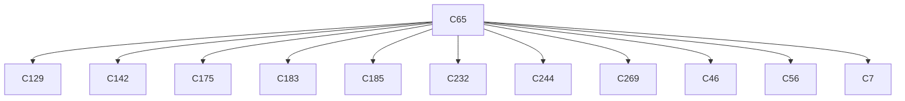
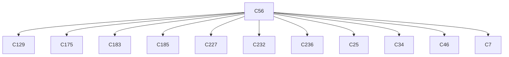

# Semantic RCA Report

---
# Incident I1

## Incident Window
2023-01-27T18:28:08.127428+00:00 → 2023-01-27T18:29:18.127428+00:00

## Root Cause

Cluster: `C65`
Score: 63.45


Component: gatekeeper-admin
Failure Mode: resource_lookup_failure
Status Class: 4xx

Behavior:
gatekeeper-admin list mutatorpodstatuses client failures (HTTP 404)

### Cluster Behavior
system:serviceaccount:gatekeeper-system:gatekeeper-admin list mutatorpodstatuses → HTTP 404 (authorization/client errors)

### Trigger Explanation
system:serviceaccount:gatekeeper-system:gatekeeper-admin attempted to list mutatorpodstatuses via  resulting in HTTP 404

### Key Signals
- trigger_score: 3.002435
- error_count: 12
- graph_out_weight: 10.949999999999998
- graph_in_weight: 8.5

### Blast Radius
Affected downstream clusters: **11**

### Trigger / Lag / Lead

- Trigger: system:serviceaccount:gatekeeper-system:gatekeeper-admin list mutatorpodstatuses → HTTP 404 (authorization/client errors)
- Lag: unknown cluster ; unknown cluster ; unknown cluster ; unknown cluster ; unknown cluster
- Lead: unknown cluster ; unknown cluster ; unknown cluster ; unknown cluster ; unknown cluster

### Causal Propagation


### Primary Evidence Event
```
"{""name"":""k8s-master-perfspec""}",2023-01-27T18:28:33.529423Z,system:serviceaccount:gatekeeper-system:gatekeeper-admin,list,mutatorpodstatuses,,,,/apis/status.gatekeeper.sh/v1beta1/mutatorpodstatuses?resourceVersion=6135954,ab64c043-a275-4c40-a81e-f39a4c546f1c,ResponseComplete,404,,,
```

## Other Possible Contributors

| Rank | Cluster | Behavior | Score | Errors |
|------|--------|----------|------|------|
| 2 | C56 | system:serviceaccount:gatekeeper-system:gatekeeper-admin list modifyset → HTTP 404 (authorization/client errors) | 62.62 | 11 |
| 3 | C117 | system:serviceaccount:kube-prometheus-stack:my-kube-prometheus-stack-operator delete secrets in namespace alertmanager-my-kube-prometheus-stack-alertmanager-tls-assets-1 → HTTP 404 (authorization/client errors) | 41.81 | 214 |
| 4 | C72 | system:serviceaccount:gatekeeper-system:gatekeeper-admin list constrainttemplates → HTTP 404 (authorization/client errors) | 37.81 | 18 |
| 5 | C71 | system:serviceaccount:gatekeeper-system:gatekeeper-admin list providers → HTTP 404 (authorization/client errors) | 37.01 | 11 |

---
# Incident I2

## Incident Window
2023-01-27T18:30:38.127428+00:00 → 2023-01-27T18:30:48.127428+00:00

## Root Cause

Cluster: `C56`
Score: 28.22


Component: gatekeeper-admin
Failure Mode: resource_lookup_failure
Status Class: 4xx

Behavior:
gatekeeper-admin list modifyset client failures (HTTP 404)

### Cluster Behavior
system:serviceaccount:gatekeeper-system:gatekeeper-admin list modifyset → HTTP 404 (authorization/client errors)

### Trigger Explanation
system:serviceaccount:gatekeeper-system:gatekeeper-admin attempted to list modifyset via  resulting in HTTP 404

### Key Signals
- trigger_score: 3.002478
- error_count: 11
- graph_out_weight: 18.45
- graph_in_weight: 14.259999999999998

### Blast Radius
Affected downstream clusters: **11**

### Trigger / Lag / Lead

- Trigger: system:serviceaccount:gatekeeper-system:gatekeeper-admin list modifyset → HTTP 404 (authorization/client errors)
- Lag: unknown cluster ; unknown cluster ; unknown cluster ; unknown cluster ; unknown cluster
- Lead: unknown cluster ; unknown cluster ; unknown cluster ; unknown cluster ; unknown cluster

### Causal Propagation


### Primary Evidence Event
```
"{""name"":""k8s-master-perfspec""}",2023-01-27T18:28:38.453815Z,system:serviceaccount:gatekeeper-system:gatekeeper-admin,list,modifyset,,,,/apis/mutations.gatekeeper.sh/v1/modifyset?resourceVersion=6135960,4ac7992b-7c4e-4de4-94bd-152f43555832,ResponseComplete,404,,,
```

## Other Possible Contributors

| Rank | Cluster | Behavior | Score | Errors |
|------|--------|----------|------|------|
| 2 | C65 | system:serviceaccount:gatekeeper-system:gatekeeper-admin list mutatorpodstatuses → HTTP 404 (authorization/client errors) | 27.82 | 12 |
| 3 | C117 | system:serviceaccount:kube-prometheus-stack:my-kube-prometheus-stack-operator delete secrets in namespace alertmanager-my-kube-prometheus-stack-alertmanager-tls-assets-1 → HTTP 404 (authorization/client errors) | 22.76 | 214 |
| 4 | C71 | system:serviceaccount:gatekeeper-system:gatekeeper-admin list providers → HTTP 404 (authorization/client errors) | 17.88 | 11 |
